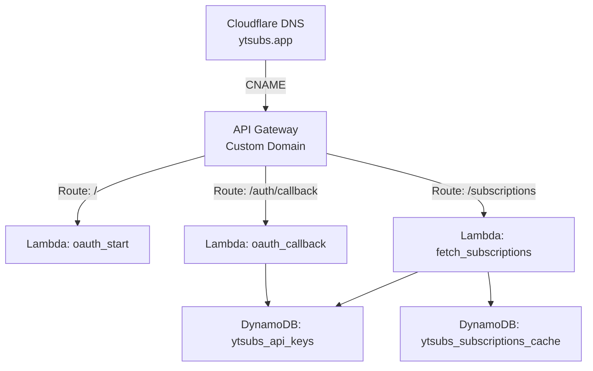

# YTSubs: YouTube Subscriptions API Service

YTSubs is a serverless web service that allows users to authenticate with their Google account and securely retrieve a cached list of their YouTube subscriptions. This system is powered by AWS Lambda, API Gateway, DynamoDB, and GitHub Actions for continuous deployment.

## ChatGPT conversation: https://chatgpt.com/c/68428518-d480-8002-b8fb-fcc16f485f61

## 🌐 Live URL

> [https://ytsubs.app](https://ytsubs.app)


## 🎯 Features

- Google OAuth2 login with YouTube access (`read-only`)
- Serverless infrastructure using AWS Lambda & API Gateway
- Automatic caching of YouTube subscriptions (refreshed every 12 hours)
- User-specific API key authentication (stored in DynamoDB)
- Friendly landing and callback pages
- GitHub Actions CI/CD for Lambda deployment

## AWS Diagram



## 📁 Repo Structure

```

ytsubs-lambdas/
├── fetch\_subscriptions.py     # Lambda for /subscriptions
├── oauth\_start.py             # Lambda for /
├── oauth\_callback.py          # Lambda for /auth/callback
└── .github/
└── workflows/
└── deploy.yml         # GitHub Actions CI/CD workflow

````


## 🔐 Environment Variables

Each Lambda function requires certain environment variables to be set in AWS:

| Variable               | Description                                    |
|------------------------|------------------------------------------------|
| `GOOGLE_CLIENT_ID`     | Google OAuth Client ID                         |
| `GOOGLE_CLIENT_SECRET` | Google OAuth Client Secret                     |
| `GOOGLE_REDIRECT_URI`  | Must match `https://ytsubs.app/auth/callback`  |


## 💾 DynamoDB Tables

- `ytsubs_api_keys`  
  Stores user-specific API keys, Google user IDs, emails, access/refresh tokens

- `ytsubs_subscriptions_cache`  
  Caches YouTube subscription data per user (12-hour TTL)


## 🛠 Deployment (via GitHub Actions)

Deployment is handled automatically using GitHub Actions.

### Secrets Required (set in GitHub > Settings > Secrets > Actions):

| Secret Name             | Value                            |
|-------------------------|----------------------------------|
| `AWS_ACCESS_KEY_ID`     | From IAM user with Lambda access |
| `AWS_SECRET_ACCESS_KEY` | From IAM user with Lambda access |
| `AWS_REGION`            | e.g., `us-west-2`                |
| `LAMBDA_FETCH_NAME`     | Name of the `fetch_subscriptions` Lambda |
| `LAMBDA_START_NAME`     | Name of the `oauth_start` Lambda |
| `LAMBDA_CALLBACK_NAME`  | Name of the `oauth_callback` Lambda |


## 🧪 API Usage

### 🔹 Authenticate User
1. Visit [https://ytsubs.app](https://ytsubs.app)
2. Sign in with Google
3. Receive API key and user ID

### 🔹 Get Subscriptions

```bash
curl "https://ytsubs.app/subscriptions?api_key=YOUR_API_KEY&google_user_id=YOUR_GOOGLE_USER_ID"
````

Returns:

```json
{
  "lastRetrievalDate": "2025-06-06T21:04:00Z",
  "subscriptions": [ ... ]
}
```

## 🔄 Future Improvements

* 🧱 CloudFront for caching and rate limiting
* 📈 Per-user usage metrics
* 🌍 Multi-region redundancy

## 🧠 Notes

* API Gateway custom domain managed via Cloudflare (`ytsubs.app`)
* TLS certificate issued via AWS ACM (auto-renewing via DNS validation)
* GitHub Actions deploys `.py` files directly using zipped CLI update
* **ChatGPT conversation: https://chatgpt.com/c/68428518-d480-8002-b8fb-fcc16f485f61**

