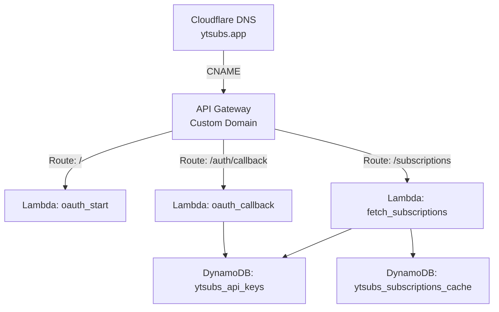

<p align="center">
  
</p>

# YTSubs: YouTube Subscriptions Exporter API Service

YTSubs is a serverless web service that allows users to authenticate with their Google account and securely retrieve a cached list of their YouTube subscriptions. This system is powered by AWS Lambda, API Gateway, DynamoDB, and GitHub Actions for continuous deployment.

This was mostly built with ChatGPT, so please provide feedback where things could be improved.

## 🌐 Live URL

> [https://ytsubs.app](https://ytsubs.app)


## 🎯 Features

- Google OAuth2 login with YouTube access (`read-only`)
- Serverless infrastructure using AWS Lambda & API Gateway
- Automatic caching of YouTube subscriptions (refreshed every 12 hours)
- User-specific API key authentication (stored in DynamoDB)
- Friendly landing and callback pages
- GitHub Actions CI/CD for Lambda deployment

## AWS Diagram



## 📁 Repo Structure

```
ytsubs-lambdas/
├── fetch\_subscriptions.py     # Lambda for /subscriptions
├── oauth\_start.py             # Lambda for / (homepage)
├── oauth\_callback.py          # Lambda for /auth/callback
├── static/                     # Static sources such as images & privacy policy
└── .github/
   └── workflows/
      └── deploy.yml         # GitHub Actions CI/CD workflow
````


## 💾 DynamoDB Tables

- `ytsubs_api_keys`  
  Stores user-specific API keys, and YouTube access/refresh tokens

- `ytsubs_subscriptions_cache`  
  Caches YouTube subscription data per user (12-hour TTL)


## 🧪 API Usage

### 🔹 Authenticate User
1. Visit [https://ytsubs.app](https://ytsubs.app)
2. Sign in with Google
3. Receive API key

### 🔹 Get Subscriptions

```bash
curl "https://ytsubs.app/subscriptions?api_key=YOUR_API_KEY"
````

Returns:

```json
{
  "lastRetrievalDate": "2025-06-06T21:04:00Z",
  "subscriptions": [ ... ]
}
```

## 🔄 Future Improvements that could be considered

* 🧱 CloudFront for caching and rate limiting
* 📈 Per-user usage metrics
* 🌍 Multi-region redundancy

## 🧠 Notes

* API Gateway custom domain managed via Cloudflare (`ytsubs.app`)
* TLS certificate issued via AWS ACM (auto-renewing via DNS validation)
* GitHub Actions deploys `.py` files directly using zipped CLI update

